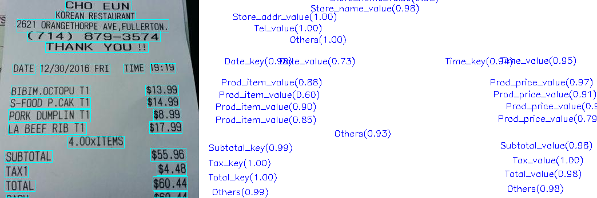

# 关键信息抽取算法-SDMGR
## 1. 算法简介

论文信息：

> [Spatial Dual-Modality Graph Reasoning for Key Information Extraction](https://arxiv.org/abs/2103.14470)
>
> Hongbin Sun and Zhanghui Kuang and Xiaoyu Yue and Chenhao Lin and Wayne Zhang
>
> 2021

在wildreceipt发票公开数据集上，算法复现效果如下：

|模型|骨干网络|配置文件|hmean|下载链接|
| --- | --- | --- | --- | --- |
|SDMGR|VGG6|[configs/kie/sdmgr/kie_unet_sdmgr.yml](../../configs/kie/sdmgr/kie_unet_sdmgr.yml)|86.70%|[训练模型]( https://paddleocr.bj.bcebos.com/dygraph_v2.1/kie/kie_vgg16.tar)/[推理模型(coming soon)]()|

## 2. 环境配置
请先参考[《运行环境准备》](./environment.md)配置PaddleOCR运行环境，参考[《项目克隆》](./clone.md)克隆项目代码。

## 3. 模型训练、评估、预测
SDMGR是一个关键信息提取算法，将每个检测到的文本区域分类为预定义的类别，如订单ID、发票号码，金额等。

训练和测试的数据采用wildreceipt数据集，通过如下指令下载数据集：
```bash
wget https://paddleocr.bj.bcebos.com/ppstructure/dataset/wildreceipt.tar && tar xf wildreceipt.tar
```

创建数据集软链到PaddleOCR/train_data目录下：
```bash
cd PaddleOCR/ && mkdir train_data && cd train_data
ln -s ../../wildreceipt ./
```

### 3.1 模型训练
训练采用的配置文件是`configs/kie/sdmgr/kie_unet_sdmgr.yml`，配置文件中默认训练数据路径是`train_data/wildreceipt`，准备好数据后，可以通过如下指令执行训练：

```bash
python3 tools/train.py -c configs/kie/sdmgr/kie_unet_sdmgr.yml -o Global.save_model_dir=./output/kie/
```

### 3.2 模型评估
执行下面的命令进行模型评估

```bash
python3 tools/eval.py -c configs/kie/sdmgr/kie_unet_sdmgr.yml -o Global.checkpoints=./output/kie/best_accuracy
```

输出信息示例如下所示:
```bash
[2022/08/10 05:22:23] ppocr INFO: metric eval ***************
[2022/08/10 05:22:23] ppocr INFO: hmean:0.8670120239257812
[2022/08/10 05:22:23] ppocr INFO: fps:10.18816520530961
```

### 3.3 模型预测

执行下面的命令进行模型预测，预测的时候需要预先加载存储图片路径以及OCR信息的文本文件，使用`Global.infer_img`进行指定。

```bash
python3 tools/infer_kie.py -c configs/kie/kie_unet_sdmgr.yml -o Global.checkpoints=kie_vgg16/best_accuracy  Global.infer_img=./train_data/wildreceipt/1.txt
```

执行预测后的结果保存在`./output/sdmgr_kie/predicts_kie.txt`文件中，可视化结果保存在`/output/sdmgr_kie/kie_results/`目录下。

可视化结果如下图所示：




## 4. 推理部署
### 4.1 Python推理
暂不支持

### 4.2 C++推理部署
暂不支持

### 4.3 Serving服务化部署
暂不支持

### 4.4 更多推理部署
暂不支持

## 5. FAQ

## 引用
```bibtex
@misc{sun2021spatial,
      title={Spatial Dual-Modality Graph Reasoning for Key Information Extraction},
      author={Hongbin Sun and Zhanghui Kuang and Xiaoyu Yue and Chenhao Lin and Wayne Zhang},
      year={2021},
      eprint={2103.14470},
      archivePrefix={arXiv},
      primaryClass={cs.CV}
}
```
