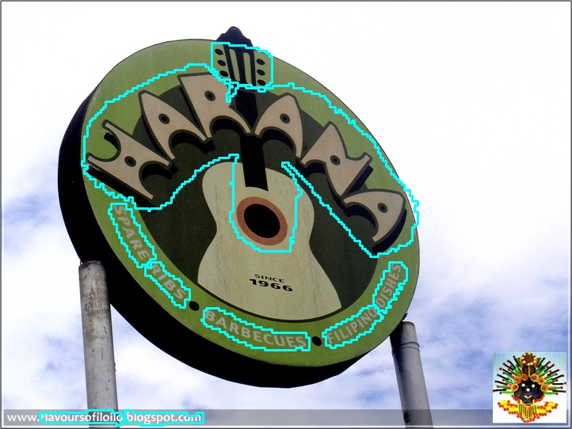

# CT
## 1. Introduction

Paper:
> [CentripetalText: An Efficient Text Instance Representation for Scene Text Detection](https://arxiv.org/abs/2107.05945)
> Tao Sheng, Jie Chen, Zhouhui Lian
> NeurIPS, 2021

On the Total-Text dataset, the text detection result is as follows:

|Model|Backbone|Configuration|Precision|Recall|Hmean|Download|
| --- | --- | --- | --- | --- | --- | --- |
|CT|ResNet18_vd|[configs/det/det_r18_vd_ct.yml](../../configs/det/det_r18_vd_ct.yml)|88.68%|81.70%|85.05%|[trained model](https://paddleocr.bj.bcebos.com/dygraph_v2.0/en/det_r18_ct_train.tar)|

## 2. Environment
Please prepare your environment referring to [prepare the environment](./environment_en.md) and [clone the repo](./clone_en.md).

## 3. Model Training / Evaluation / Prediction
The above CT model is trained using the Total-Text text detection public dataset. For the download of the dataset, please refer to [Total-Text-Dataset](https://github.com/cs-chan/Total-Text-Dataset/tree/master/Dataset). PaddleOCR format annotation download link [train.txt](https://paddleocr.bj.bcebos.com/dataset/ct_tipc/train.txt), [test.txt](https://paddleocr.bj.bcebos.com/dataset/ct_tipc/test.txt).

Please refer to [text detection training tutorial](./detection_en.md). PaddleOCR has modularized the code structure, so that you only need to **replace the configuration file** to train different detection models.

## 4. Inference and Deployment
### 4.1 Python Inference
First, convert the model saved in the CT text detection training process into an inference model. Taking the model based on the Resnet18_vd backbone network and trained on the Total Text English dataset as example ([model download link](https://paddleocr.bj.bcebos.com/dygraph_v2.0/en/det_r18_ct_train.tar)), you can use the following command to convert:
```bash
python3 tools/export_model.py -c configs/det/det_r18_vd_ct.yml -o Global.pretrained_model=./det_r18_ct_train/best_accuracy  Global.save_inference_dir=./inference/det_ct
```

CT text detection model inference, you can execute the following command:

```bash
python3 tools/infer/predict_det.py --image_dir="./doc/imgs_en/img623.jpg" --det_model_dir="./inference/det_ct/" --det_algorithm="CT"
```

The visualized text detection results are saved to the `./inference_results` folder by default, and the name of the result file is prefixed with `det_res`. Examples of results are as follows:




### 4.2 C++ Inference
Not supported

### 4.3 Serving
Not supported

### 4.4 More
Not supported

## 5. FAQ

## Citation
```bibtex
@inproceedings{sheng2021centripetaltext,
    title={CentripetalText: An Efficient Text Instance Representation for Scene Text Detection},
    author={Tao Sheng and Jie Chen and Zhouhui Lian},
    booktitle={Thirty-Fifth Conference on Neural Information Processing Systems},
    year={2021}
}
```
