# 快速构建卡证类OCR

## 1. 金融行业卡证识别应用
### 1.1 金融行业中的OCR相关技术

《“十四五”数字经济发展规划》指出，2020年我国数字经济核心产业增加值占GDP比重达7.8％，随着数字经济迈向全面扩展，到2025年该比例将提升至10％。

在过去数年的跨越发展与积累沉淀中，数字金融、金融科技已在对金融业的重塑与再造中充分印证了其自身价值。

以智能为目标，提升金融数字化水平，实现业务流程自动化，降低人力成本。

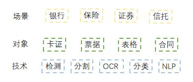

### 1.2 金融行业中的卡证识别场景介绍
应用场景：身份证、银行卡、营业执照、驾驶证等。

应用难点：由于数据的采集来源多样，以及实际采集数据各种噪声：反光、褶皱、模糊、倾斜等各种问题干扰。


### 1.3 OCR落地挑战


## 2. 卡证识别技术解析


### 2.1 卡证分类模型
卡证分类：基于PPLCNet

与其他轻量级模型相比在CPU环境下ImageNet数据集上的表现


模型来自模型库PaddleClas，它是一个图像识别和图像分类任务的工具集，助力使用者训练出更好的视觉模型和应用落地。

### 2.2 卡证识别模型
检测：DBNet  识别：SVRT


PPOCRv3在文本检测、识别进行了一系列改进优化，在保证精度的同时提升预测效率

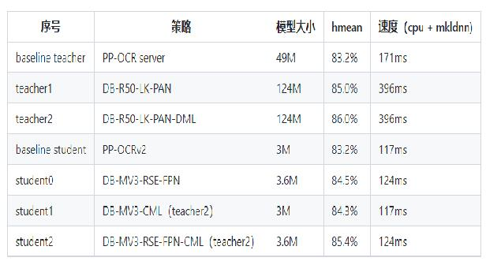

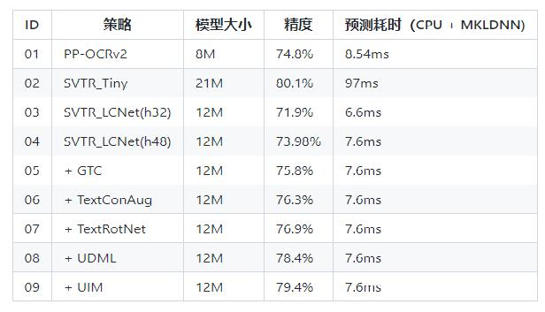

## 3. OCR技术拆解
### 3.1技术流程

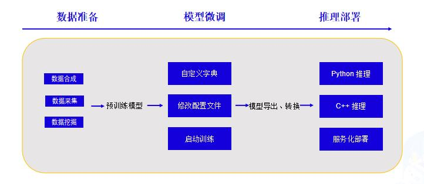


### 3.2 OCR技术拆解---卡证分类
####  卡证分类：数据、模型准备
A  使用爬虫获取无标注数据，将相同类别的放在同一文件夹下，文件名从0开始命名。具体格式如下图所示。

​注：卡证类数据，建议每个类别数据量在500张以上


B 一行命令生成标签文件

```bash
tree -r -i -f | grep -E "jpg|JPG|jpeg|JPEG|png|PNG|webp" | awk -F "/" '{print $0" "$2}' > train_list.txt
```

C [下载预训练模型 ](https://github.com/PaddlePaddle/PaddleClas/blob/release/2.4/docs/zh_CN/models/PP-LCNet.md)

####  卡证分类---修改配置文件
配置文件主要修改三个部分：

  - 全局参数：预训练模型路径/训练轮次/图像尺寸
  - 模型结构：分类数
  - 数据处理：训练/评估数据路径

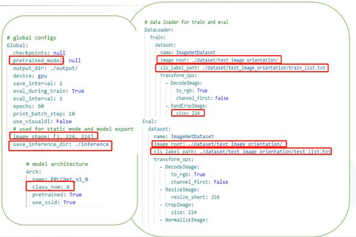

#### 卡证分类---训练
指定配置文件启动训练：

```bash
!python /home/aistudio/work/PaddleClas/tools/train.py -c   /home/aistudio/work/PaddleClas/ppcls/configs/PULC/text_image_orientation/PPLCNet_x1_0.yaml
```


​注：日志中显示了训练结果和评估结果（训练时可以设置固定轮数评估一次）

### 3.2 OCR技术拆解---卡证识别
卡证识别（以身份证检测为例）
存在的困难及问题：

  * 在自然场景下，由于各种拍摄设备以及光线、角度不同等影响导致实际得到的证件影像千差万别。

  * 如何快速提取需要的关键信息

  * 多行的文本信息，检测结果如何正确拼接

  

* OCR技术拆解---OCR工具库

    PaddleOCR是一个丰富、领先且实用的OCR工具库，助力开发者训练出更好的模型并应用落地


身份证识别：用现有的方法识别

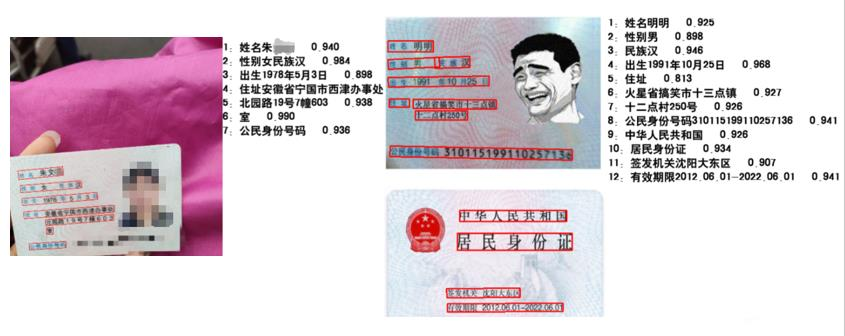


####  身份证识别：检测+分类
> 方法：基于现有的dbnet检测模型，加入分类方法。检测同时进行分类，从一定程度上优化识别流程


#### 数据标注
使用PaddleOCRLable进行快速标注

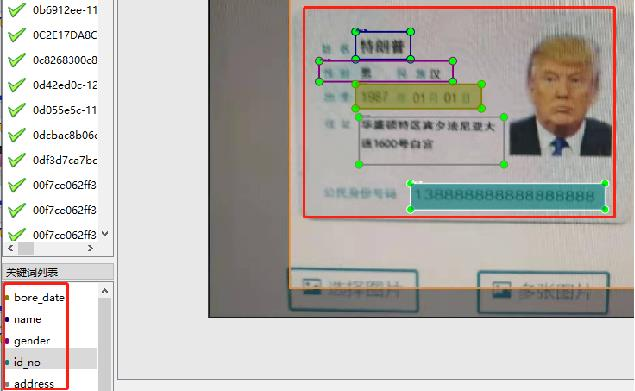

* 修改PPOCRLabel.py，将下图中的kie参数设置为True


* 数据标注踩坑分享


​    注：两者只有标注有差别，训练参数数据集都相同

## 4 . 项目实践

AIStudio项目链接：[快速构建卡证类OCR](https://aistudio.baidu.com/aistudio/projectdetail/4459116)

### 4.1 环境准备

1）拉取[paddleocr](https://github.com/PaddlePaddle/PaddleOCR)项目，如果从github上拉取速度慢可以选择从gitee上获取。
```bash
!git clone https://github.com/PaddlePaddle/PaddleOCR.git  -b release/2.6  /home/aistudio/work/
```

2）获取并解压预训练模型，如果要使用其他模型可以从模型库里自主选择合适模型。
```bash
!wget -P work/pre_trained/   https://paddleocr.bj.bcebos.com/PP-OCRv3/chinese/ch_PP-OCRv3_det_distill_train.tar
!tar -vxf /home/aistudio/work/pre_trained/ch_PP-OCRv3_det_distill_train.tar -C /home/aistudio/work/pre_trained
```
3）安装必要依赖
```bash
!pip install -r /home/aistudio/work/requirements.txt
```

### 4.2 配置文件修改
修改配置文件 `work/configs/det/detmv3db.yml`

具体修改说明如下：

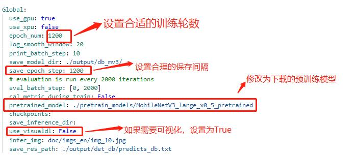

注：在上述的配置文件的Global变量中需要添加以下两个参数：

​  - label_list 为标签表
​  - num_classes 为分类数
​上述两个参数根据实际的情况配置即可


其中lable_list内容如下例所示，***建议第一个参数设置为 background，不要设置为实际要提取的关键信息种类***：

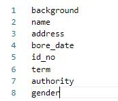

配置文件中的其他设置说明


### 4.3 代码修改
#### 4.3.1 数据读取
修改 PaddleOCR/ppocr/data/imaug/label_ops.py中的DetLabelEncode

```python
class DetLabelEncode(object):

    # 修改检测标签的编码处，新增了参数分类数：num_classes，重写初始化方法，以及分类标签的读取

    def __init__(self, label_list, num_classes=8, **kwargs):
        self.num_classes = num_classes
        self.label_list = []
        if label_list:
            if isinstance(label_list, str):
                with open(label_list, 'r+', encoding='utf-8') as f:
                    for line in f.readlines():
                        self.label_list.append(line.replace("\n", ""))
            else:
                self.label_list = label_list
        else:
            assert ' please check label_list whether it is none or config is right'

        if num_classes != len(self.label_list): # 校验分类数和标签的一致性
            assert 'label_list length is not equal to the num_classes'

    def __call__(self, data):
        label = data['label']
        label = json.loads(label)
        nBox = len(label)
        boxes, txts, txt_tags, classes = [], [], [], []
        for bno in range(0, nBox):
            box = label[bno]['points']
            txt = label[bno]['key_cls']  # 此处将kie中的参数作为分类读取
            boxes.append(box)
            txts.append(txt)

            if txt in ['*', '###']:
                txt_tags.append(True)
                if self.num_classes > 1:
                    classes.append(-2)
            else:
                txt_tags.append(False)
                if self.num_classes > 1:  # 将KIE内容的key标签作为分类标签使用
                    classes.append(int(self.label_list.index(txt)))

        if len(boxes) == 0:

            return None
        boxes = self.expand_points_num(boxes)
        boxes = np.array(boxes, dtype=np.float32)
        txt_tags = np.array(txt_tags, dtype=np.bool_)
        classes = classes
        data['polys'] = boxes
        data['texts'] = txts
        data['ignore_tags'] = txt_tags
        if self.num_classes > 1:
            data['classes'] = classes
        return data
```

修改P`addleOCR/ppocr/data/imaug/make_shrink_map.py`中的MakeShrinkMap类。这里需要注意的是，如果我们设置的label_list中的第一个参数为要检测的信息那么会得到如下的mask,

举例说明：
这是检测的mask图，图中有四个mask那么实际对应的分类应该是4类


label_list中第一个为关键分类，则得到的分类Mask实际如下，与上图相比，少了一个box：

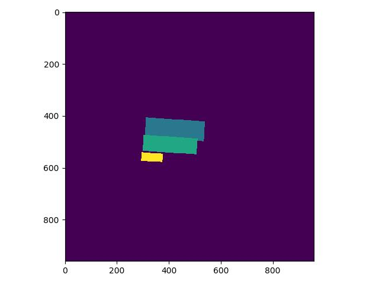


```python
class MakeShrinkMap(object):
    r'''
    Making binary mask from detection data with ICDAR format.
    Typically following the process of class `MakeICDARData`.
    '''

    def __init__(self, min_text_size=8, shrink_ratio=0.4, num_classes=8, **kwargs):
        self.min_text_size = min_text_size
        self.shrink_ratio = shrink_ratio
        self.num_classes = num_classes  #  添加了分类

    def __call__(self, data):
        image = data['image']
        text_polys = data['polys']
        ignore_tags = data['ignore_tags']
        if self.num_classes > 1:
            classes = data['classes']

        h, w = image.shape[:2]
        text_polys, ignore_tags = self.validate_polygons(text_polys,
                                                         ignore_tags, h, w)
        gt = np.zeros((h, w), dtype=np.float32)
        mask = np.ones((h, w), dtype=np.float32)
        gt_class = np.zeros((h, w), dtype=np.float32)  # 新增分类
        for i in range(len(text_polys)):
            polygon = text_polys[i]
            height = max(polygon[:, 1]) - min(polygon[:, 1])
            width = max(polygon[:, 0]) - min(polygon[:, 0])
            if ignore_tags[i] or min(height, width) < self.min_text_size:
                cv2.fillPoly(mask,
                             polygon.astype(np.int32)[np.newaxis, :, :], 0)
                ignore_tags[i] = True
            else:
                polygon_shape = Polygon(polygon)
                subject = [tuple(l) for l in polygon]
                padding = pyclipper.PyclipperOffset()
                padding.AddPath(subject, pyclipper.JT_ROUND,
                                pyclipper.ET_CLOSEDPOLYGON)
                shrinked = []

                # Increase the shrink ratio every time we get multiple polygon returned back
                possible_ratios = np.arange(self.shrink_ratio, 1,
                                            self.shrink_ratio)
                np.append(possible_ratios, 1)
                for ratio in possible_ratios:
                    distance = polygon_shape.area * (
                        1 - np.power(ratio, 2)) / polygon_shape.length
                    shrinked = padding.Execute(-distance)
                    if len(shrinked) == 1:
                        break

                if shrinked == []:
                    cv2.fillPoly(mask,
                                 polygon.astype(np.int32)[np.newaxis, :, :], 0)
                    ignore_tags[i] = True
                    continue

                for each_shirnk in shrinked:
                    shirnk = np.array(each_shirnk).reshape(-1, 2)
                    cv2.fillPoly(gt, [shirnk.astype(np.int32)], 1)
                    if self.num_classes > 1:  # 绘制分类的mask
                        cv2.fillPoly(gt_class, polygon.astype(np.int32)[np.newaxis, :, :], classes[i])


        data['shrink_map'] = gt

        if self.num_classes > 1:
            data['class_mask'] = gt_class

        data['shrink_mask'] = mask
        return data
```

由于在训练数据中会对数据进行resize设置，yml中的操作为：`EastRandomCropData`，所以需要修改`PaddleOCR/ppocr/data/imaug/random_crop_data.py`中的`EastRandomCropData`


```python
class EastRandomCropData(object):
    def __init__(self,
                 size=(640, 640),
                 max_tries=10,
                 min_crop_side_ratio=0.1,
                 keep_ratio=True,
                 num_classes=8,
                 **kwargs):
        self.size = size
        self.max_tries = max_tries
        self.min_crop_side_ratio = min_crop_side_ratio
        self.keep_ratio = keep_ratio
        self.num_classes = num_classes

    def __call__(self, data):
        img = data['image']
        text_polys = data['polys']
        ignore_tags = data['ignore_tags']
        texts = data['texts']
        if self.num_classes > 1:
            classes = data['classes']
        all_care_polys = [
            text_polys[i] for i, tag in enumerate(ignore_tags) if not tag
        ]
        # 计算crop区域
        crop_x, crop_y, crop_w, crop_h = crop_area(
            img, all_care_polys, self.min_crop_side_ratio, self.max_tries)
        # crop 图片 保持比例填充
        scale_w = self.size[0] / crop_w
        scale_h = self.size[1] / crop_h
        scale = min(scale_w, scale_h)
        h = int(crop_h * scale)
        w = int(crop_w * scale)
        if self.keep_ratio:
            padimg = np.zeros((self.size[1], self.size[0], img.shape[2]),
                              img.dtype)
            padimg[:h, :w] = cv2.resize(
                img[crop_y:crop_y + crop_h, crop_x:crop_x + crop_w], (w, h))
            img = padimg
        else:
            img = cv2.resize(
                img[crop_y:crop_y + crop_h, crop_x:crop_x + crop_w],
                tuple(self.size))
        # crop 文本框
        text_polys_crop = []
        ignore_tags_crop = []
        texts_crop = []
        classes_crop = []
        for poly, text, tag,class_index in zip(text_polys, texts, ignore_tags,classes):
            poly = ((poly - (crop_x, crop_y)) * scale).tolist()
            if not is_poly_outside_rect(poly, 0, 0, w, h):
                text_polys_crop.append(poly)
                ignore_tags_crop.append(tag)
                texts_crop.append(text)
                if self.num_classes > 1:
                    classes_crop.append(class_index)
        data['image'] = img
        data['polys'] = np.array(text_polys_crop)
        data['ignore_tags'] = ignore_tags_crop
        data['texts'] = texts_crop
        if self.num_classes > 1:
            data['classes'] = classes_crop
        return data
```

#### 4.3.2  head修改
主要修改`ppocr/modeling/heads/det_db_head.py`，将Head类中的最后一层的输出修改为实际的分类数，同时在DBHead中新增分类的head。


#### 4.3.3 修改loss
修改`PaddleOCR/ppocr/losses/det_db_loss.py`中的DBLoss类，分类采用交叉熵损失函数进行计算。

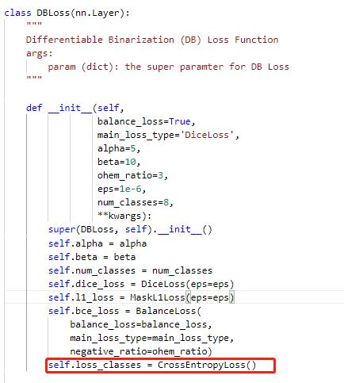


#### 4.3.4 后处理
由于涉及到eval以及后续推理能否正常使用，我们需要修改后处理的相关代码，修改位置`PaddleOCR/ppocr/postprocess/db_postprocess.py`中的DBPostProcess类

```python
class DBPostProcess(object):
    """
    The post process for Differentiable Binarization (DB).
    """

    def __init__(self,
                 thresh=0.3,
                 box_thresh=0.7,
                 max_candidates=1000,
                 unclip_ratio=2.0,
                 use_dilation=False,
                 score_mode="fast",
                 **kwargs):
        self.thresh = thresh
        self.box_thresh = box_thresh
        self.max_candidates = max_candidates
        self.unclip_ratio = unclip_ratio
        self.min_size = 3
        self.score_mode = score_mode
        assert score_mode in [
            "slow", "fast"
        ], "Score mode must be in [slow, fast] but got: {}".format(score_mode)

        self.dilation_kernel = None if not use_dilation else np.array(
            [[1, 1], [1, 1]])

    def boxes_from_bitmap(self, pred, _bitmap, classes, dest_width, dest_height):
        """
        _bitmap: single map with shape (1, H, W),
                whose values are binarized as {0, 1}
        """

        bitmap = _bitmap
        height, width = bitmap.shape

        outs = cv2.findContours((bitmap * 255).astype(np.uint8), cv2.RETR_LIST,
                                cv2.CHAIN_APPROX_SIMPLE)
        if len(outs) == 3:
            img, contours, _ = outs[0], outs[1], outs[2]
        elif len(outs) == 2:
            contours, _ = outs[0], outs[1]

        num_contours = min(len(contours), self.max_candidates)

        boxes = []
        scores = []
        class_indexes = []
        class_scores = []
        for index in range(num_contours):
            contour = contours[index]
            points, sside = self.get_mini_boxes(contour)
            if sside < self.min_size:
                continue
            points = np.array(points)
            if self.score_mode == "fast":
                score, class_index, class_score = self.box_score_fast(pred, points.reshape(-1, 2), classes)
            else:
                score, class_index, class_score = self.box_score_slow(pred, contour, classes)
            if self.box_thresh > score:
                continue

            box = self.unclip(points).reshape(-1, 1, 2)
            box, sside = self.get_mini_boxes(box)
            if sside < self.min_size + 2:
                continue
            box = np.array(box)

            box[:, 0] = np.clip(
                np.round(box[:, 0] / width * dest_width), 0, dest_width)
            box[:, 1] = np.clip(
                np.round(box[:, 1] / height * dest_height), 0, dest_height)

            boxes.append(box.astype(np.int16))
            scores.append(score)

            class_indexes.append(class_index)
            class_scores.append(class_score)

        if classes is None:
            return np.array(boxes, dtype=np.int16), scores
        else:
            return np.array(boxes, dtype=np.int16), scores, class_indexes, class_scores

    def unclip(self, box):
        unclip_ratio = self.unclip_ratio
        poly = Polygon(box)
        distance = poly.area * unclip_ratio / poly.length
        offset = pyclipper.PyclipperOffset()
        offset.AddPath(box, pyclipper.JT_ROUND, pyclipper.ET_CLOSEDPOLYGON)
        expanded = np.array(offset.Execute(distance))
        return expanded

    def get_mini_boxes(self, contour):
        bounding_box = cv2.minAreaRect(contour)
        points = sorted(list(cv2.boxPoints(bounding_box)), key=lambda x: x[0])

        index_1, index_2, index_3, index_4 = 0, 1, 2, 3
        if points[1][1] > points[0][1]:
            index_1 = 0
            index_4 = 1
        else:
            index_1 = 1
            index_4 = 0
        if points[3][1] > points[2][1]:
            index_2 = 2
            index_3 = 3
        else:
            index_2 = 3
            index_3 = 2

        box = [
            points[index_1], points[index_2], points[index_3], points[index_4]
        ]
        return box, min(bounding_box[1])

    def box_score_fast(self, bitmap, _box, classes):
        '''
        box_score_fast: use bbox mean score as the mean score
        '''
        h, w = bitmap.shape[:2]
        box = _box.copy()
        xmin = np.clip(np.floor(box[:, 0].min()).astype(np.int32), 0, w - 1)
        xmax = np.clip(np.ceil(box[:, 0].max()).astype(np.int32), 0, w - 1)
        ymin = np.clip(np.floor(box[:, 1].min()).astype(np.int32), 0, h - 1)
        ymax = np.clip(np.ceil(box[:, 1].max()).astype(np.int32), 0, h - 1)

        mask = np.zeros((ymax - ymin + 1, xmax - xmin + 1), dtype=np.uint8)
        box[:, 0] = box[:, 0] - xmin
        box[:, 1] = box[:, 1] - ymin
        cv2.fillPoly(mask, box.reshape(1, -1, 2).astype(np.int32), 1)

        if classes is None:
            return cv2.mean(bitmap[ymin:ymax + 1, xmin:xmax + 1], mask)[0], None, None
        else:
            k = 999
            class_mask = np.full((ymax - ymin + 1, xmax - xmin + 1), k, dtype=np.int32)

            cv2.fillPoly(class_mask, box.reshape(1, -1, 2).astype(np.int32), 0)
            classes = classes[ymin:ymax + 1, xmin:xmax + 1]

            new_classes = classes + class_mask
            a = new_classes.reshape(-1)
            b = np.where(a >= k)
            classes = np.delete(a, b[0].tolist())

            class_index = np.argmax(np.bincount(classes))
            class_score = np.sum(classes == class_index) / len(classes)

            return cv2.mean(bitmap[ymin:ymax + 1, xmin:xmax + 1], mask)[0], class_index, class_score

    def box_score_slow(self, bitmap, contour, classes):
        """
        box_score_slow: use polyon mean score as the mean score
        """
        h, w = bitmap.shape[:2]
        contour = contour.copy()
        contour = np.reshape(contour, (-1, 2))

        xmin = np.clip(np.min(contour[:, 0]), 0, w - 1)
        xmax = np.clip(np.max(contour[:, 0]), 0, w - 1)
        ymin = np.clip(np.min(contour[:, 1]), 0, h - 1)
        ymax = np.clip(np.max(contour[:, 1]), 0, h - 1)

        mask = np.zeros((ymax - ymin + 1, xmax - xmin + 1), dtype=np.uint8)

        contour[:, 0] = contour[:, 0] - xmin
        contour[:, 1] = contour[:, 1] - ymin

        cv2.fillPoly(mask, contour.reshape(1, -1, 2).astype(np.int32), 1)

        if classes is None:
            return cv2.mean(bitmap[ymin:ymax + 1, xmin:xmax + 1], mask)[0], None, None
        else:
            k = 999
            class_mask = np.full((ymax - ymin + 1, xmax - xmin + 1), k, dtype=np.int32)

            cv2.fillPoly(class_mask, contour.reshape(1, -1, 2).astype(np.int32), 0)
            classes = classes[ymin:ymax + 1, xmin:xmax + 1]

            new_classes = classes + class_mask
            a = new_classes.reshape(-1)
            b = np.where(a >= k)
            classes = np.delete(a, b[0].tolist())

            class_index = np.argmax(np.bincount(classes))
            class_score = np.sum(classes == class_index) / len(classes)

            return cv2.mean(bitmap[ymin:ymax + 1, xmin:xmax + 1], mask)[0], class_index, class_score

    def __call__(self, outs_dict, shape_list):
        pred = outs_dict['maps']
        if isinstance(pred, paddle.Tensor):
            pred = pred.numpy()
        pred = pred[:, 0, :, :]
        segmentation = pred > self.thresh

        if "classes" in outs_dict:
            classes = outs_dict['classes']
            if isinstance(classes, paddle.Tensor):
                classes = classes.numpy()
            classes = classes[:, 0, :, :]

        else:
            classes = None

        boxes_batch = []
        for batch_index in range(pred.shape[0]):
            src_h, src_w, ratio_h, ratio_w = shape_list[batch_index]
            if self.dilation_kernel is not None:
                mask = cv2.dilate(
                    np.array(segmentation[batch_index]).astype(np.uint8),
                    self.dilation_kernel)
            else:
                mask = segmentation[batch_index]

            if classes is None:
                boxes, scores = self.boxes_from_bitmap(pred[batch_index], mask, None,
                                                       src_w, src_h)
                boxes_batch.append({'points': boxes})
            else:
                boxes, scores, class_indexes, class_scores = self.boxes_from_bitmap(pred[batch_index], mask,
                                                                                      classes[batch_index],
                                                                                      src_w, src_h)
                boxes_batch.append({'points': boxes, "classes": class_indexes, "class_scores": class_scores})

        return boxes_batch
```

### 4.4. 模型启动
在完成上述步骤后我们就可以正常启动训练

```bash
!python /home/aistudio/work/PaddleOCR/tools/train.py  -c  /home/aistudio/work/PaddleOCR/configs/det/det_mv3_db.yml
```

其他命令：
```bash
!python /home/aistudio/work/PaddleOCR/tools/eval.py  -c  /home/aistudio/work/PaddleOCR/configs/det/det_mv3_db.yml
!python /home/aistudio/work/PaddleOCR/tools/infer_det.py  -c  /home/aistudio/work/PaddleOCR/configs/det/det_mv3_db.yml
```

模型推理
```bash
!python /home/aistudio/work/PaddleOCR/tools/infer/predict_det.py --image_dir="/home/aistudio/work/test_img/" --det_model_dir="/home/aistudio/work/PaddleOCR/output/infer"
```

## 5 总结
1. 分类+检测在一定程度上能够缩短用时，具体的模型选取要根据业务场景恰当选择。
2. 数据标注需要多次进行测试调整标注方法，一般进行检测模型微调，需要标注至少上百张。
3. 设置合理的batch_size以及resize大小，同时注意lr设置。

##  References
1. https://github.com/PaddlePaddle/PaddleOCR
2. https://github.com/PaddlePaddle/PaddleClas
3. https://blog.csdn.net/YY007H/article/details/124491217
