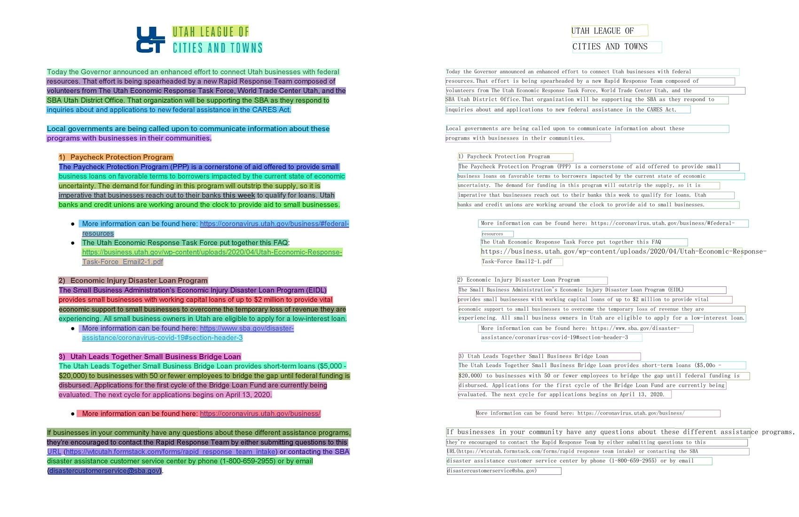

 
  

      
      
      
      
      
      
      
  

## 简介

PaddleOCR 旨在打造一套丰富、领先、且实用的 OCR 工具库，助力开发者训练出更好的模型，并应用落地。

## 🚀 社区

PaddleOCR 由 [PMC](https://github.com/PaddlePaddle/PaddleOCR/issues/12122) 监督。Issues 和 PRs 将在尽力的基础上进行审查。欲了解 PaddlePaddle 社区的完整概况，请访问 [community](https://github.com/PaddlePaddle/community)。

⚠️注意：[Issues](https://github.com/PaddlePaddle/PaddleOCR/issues)模块仅用来报告程序🐞Bug，其余提问请移步[Discussions](https://github.com/PaddlePaddle/PaddleOCR/discussions)模块提问。如所提Issue不是Bug，会被移到Discussions模块，敬请谅解。

## 📣 近期更新

- **🔥2024.7 添加 PaddleOCR 算法模型挑战赛冠军方案**：

  - 赛题一：OCR 端到端识别任务冠军方案——[场景文本识别算法-SVTRv2](./algorithm/text_recognition/algorithm_rec_svtrv2.md)；
  - 赛题二：通用表格识别任务冠军方案——[表格识别算法-SLANet-LCNetV2](./algorithm/table_recognition/algorithm_table_slanet.md)。

- **💥2024.6.27 飞桨低代码开发工具 [PaddleX 3.0](https://github.com/paddlepaddle/paddlex) 重磅更新！**

  - 低代码开发范式：支持 OCR 模型全流程低代码开发，提供 Python API，支持用户自定义串联模型；
  - 多硬件训推支持：支持英伟达 GPU、昆仑芯、昇腾和寒武纪等多种硬件进行模型训练与推理。PaddleOCR支持的模型见 [模型列表](./model/hardware/install_other_devices.md)

- **📚直播和OCR实战打卡营预告**：《PP-ChatOCRv2赋能金融报告信息智能化抽取，新金融效率再升级》课程上线，破解复杂版面、表格识别、信息抽取OCR解析难题，直播时间：6月6日（周四）19：00。并于6月11日启动【政务采购合同信息抽取】实战打卡营。报名链接：<https://www.wjx.top/vm/eBcYmqO.aspx?udsid=197406>

- **🔥2024.5.10 上线星河零代码产线(OCR 相关)**：全面覆盖了以下四大 OCR 核心任务，提供极便捷的 Badcase 分析和实用的在线体验：

  - [通用 OCR](https://aistudio.baidu.com/community/app/91660) (PP-OCRv4)。
  - [通用表格识别](https://aistudio.baidu.com/community/app/91661) (SLANet)。
  - [通用图像信息抽取](https://aistudio.baidu.com/community/app/91662) (PP-ChatOCRv2-common)。
  - [文档场景信息抽取](https://aistudio.baidu.com/community/app/70303) (PP-ChatOCRv2-doc)。

  同时采用了 **[全新的场景任务开发范式](https://aistudio.baidu.com/pipeline/mine)** ,将模型统一汇聚，实现训练部署的零代码开发，并支持在线服务化部署和导出离线服务化部署包。

- **🔥2023.8.7 发布 PaddleOCR [release/2.7](https://github.com/PaddlePaddle/PaddleOCR/tree/release/2.7)**

  - 发布[PP-OCRv4](./doc/doc_ch/PP-OCRv4_introduction.md)，提供 mobile 和 server 两种模型
  - PP-OCRv4-mobile：速度可比情况下，中文场景效果相比于 PP-OCRv3 再提升 4.5%，英文场景提升 10%，80 语种多语言模型平均识别准确率提升 8%以上
  - PP-OCRv4-server：发布了目前精度最高的 OCR 模型，中英文场景上检测模型精度提升 4.9%， 识别模型精度提升 2%
    可参考[快速开始](./quick_start.md) 一行命令快速使用，同时也可在飞桨 AI 套件(PaddleX)中的[通用 OCR 产业方案](https://aistudio.baidu.com/aistudio/modelsdetail?modelId=286)中低代码完成模型训练、推理、高性能部署全流程

- 🔨**2022.11 新增实现[4 种前沿算法](./algorithm/overview.md)**：文本检测 [DRRG](./algorithm/text_detection/algorithm_det_drrg.md),  文本识别 [RFL](./algorithm/text_recognition/algorithm_rec_rfl.md), 文本超分[Text Telescope](./algorithm/super_resolution/algorithm_sr_telescope.md)，公式识别[CAN](./algorithm/formula_recognition/algorithm_rec_can.md)
- **2022.10 优化[JS 版 PP-OCRv3 模型](./ppocr/infer_deploy/paddle_js.md)**：模型大小仅 4.3M，预测速度提升 8 倍，配套 web demo 开箱即用
- **💥 直播回放：PaddleOCR 研发团队详解 PP-StructureV2 优化策略**。微信扫描[下方二维码](#开源社区)，关注公众号并填写问卷后进入官方交流群，获取直播回放链接与 20G 重磅 OCR 学习大礼包（内含 PDF 转 Word 应用程序、10 种垂类模型、《动手学 OCR》电子书等）
-
- **🔥2022.8.24 发布 PaddleOCR [release/2.6](https://github.com/PaddlePaddle/PaddleOCR/tree/release/2.6)**：

  - 发布[PP-StructureV2](./ppstructure/overview.md)，系统功能性能全面升级，适配中文场景，新增支持[版面复原](./ppstructure/model_train/recovery_to_doc.md)，支持**一行命令完成 PDF 转 Word**；
  - [版面分析](./ppstructure/model_train/train_layout.md)模型优化：模型存储减少 95%，速度提升 11 倍，平均 CPU 耗时仅需 41ms；
  - [表格识别](./ppstructure/model_train/train_table.md)模型优化：设计 3 大优化策略，预测耗时不变情况下，模型精度提升 6%；
  - [关键信息抽取](./ppstructure/model_train/train_kie.md)模型优化：设计视觉无关模型结构，语义实体识别精度提升 2.8%，关系抽取精度提升 9.1%。
- 🔥**2022.8 发布 [OCR 场景应用集合](./applications/overview.md)**：包含数码管、液晶屏、车牌、高精度 SVTR 模型、手写体识别等**9 个垂类模型**，覆盖通用，制造、金融、交通行业的主要 OCR 垂类应用。

> [更多](./update.md)

## 🌟 特性

支持多种 OCR 相关前沿算法，在此基础上打造产业级特色模型[PP-OCR](./ppocr/overview.md)、[PP-Structure](./ppstructure/overview.md)和[PP-ChatOCRv2](https://aistudio.baidu.com/community/app/70303)，并打通数据生产、模型训练、压缩、预测部署全流程。

## 效果展示

### 超轻量PP-OCRv3效果展示

#### PP-OCRv3中文模型

#### PP-OCRv3英文数字模型

#### PP-OCRv3多语言模型

#### PP-Structure 文档分析

- 版面分析+表格识别

  

- SER（语义实体识别）

  

  

  

- RE（关系提取）

  

  

  

## 许可证书

本项目的发布受<a href="https://github.com/PaddlePaddle/PaddleOCR/blob/master/LICENSE">Apache 2.0 license</a>许可认证。
