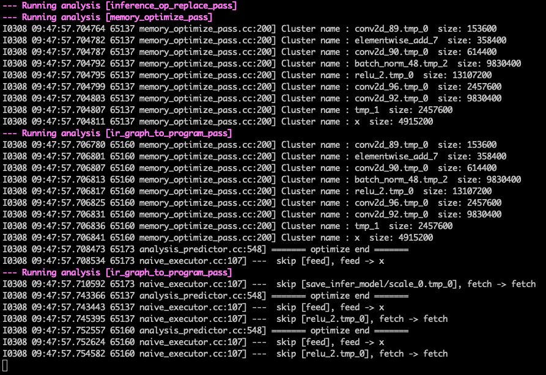
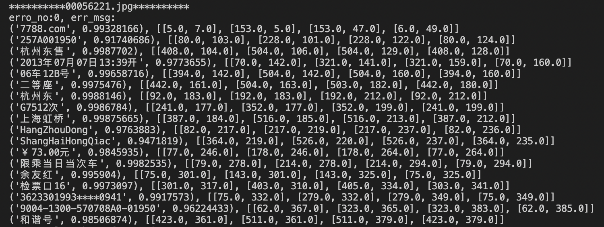
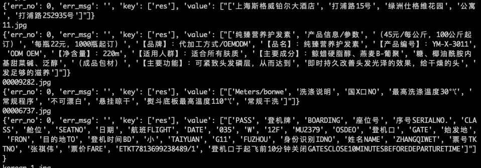

# PPOCR 服务化部署

PaddleOCR提供2种服务部署方式：
- 基于PaddleHub Serving的部署：代码路径为"`./deploy/hubserving`"，使用方法参考[文档](../../deploy/hubserving/readme.md)；
- 基于PaddleServing的部署：代码路径为"`./deploy/pdserving`"，按照本教程使用。


# 基于PaddleServing的服务部署

本文档将介绍如何使用[PaddleServing](https://github.com/PaddlePaddle/Serving/blob/develop/README_CN.md) 工具部署PP-OCR动态图模型的pipeline在线服务。

相比较于hubserving部署，PaddleServing具备以下优点：
- 支持客户端和服务端之间高并发和高效通信
- 支持 工业级的服务能力 例如模型管理，在线加载，在线A/B测试等
- 支持 多种编程语言 开发客户端，例如C++, Python和Java

PaddleServing 支持多种语言部署，本例中提供了python pipeline 和 C++ 两种部署方式，两者的对比如下：

| 语言   | 速度 | 二次开发 | 是否需要编译                           |
| ------ | ---- | -------- | -------------------------------------- |
| C++    | 很快 | 略有难度 | 单模型预测无需编译，多模型串联需要编译 |
| python | 一般 | 容易     | 单模型/多模型 均无需编译               |


更多有关PaddleServing服务化部署框架介绍和使用教程参考[文档](https://github.com/PaddlePaddle/Serving/blob/develop/README_CN.md)。

AIStudio演示案例可参考 [基于PaddleServing的OCR服务化部署实战](https://aistudio.baidu.com/aistudio/projectdetail/3630726)。

## 目录
- [PPOCR 服务化部署](#ppocr-服务化部署)
- [基于PaddleServing的服务部署](#基于paddleserving的服务部署)
    - [目录](#目录)
    - [环境准备](#环境准备)
    - [模型转换](#模型转换)
    - [Paddle Serving pipeline部署](#paddle-serving-pipeline部署)
    - [Paddle Serving C++ 部署](#paddle-serving-c-部署)
    - [Windows用户](#windows用户)
    - [FAQ](#faq)

## 环境准备

需要准备PaddleOCR的运行环境和Paddle Serving的运行环境。

- 准备PaddleOCR的运行环境[链接](../../doc/doc_ch/installation.md)

    ```
    git clone https://github.com/PaddlePaddle/PaddleOCR

    # 进入到工作目录
    cd PaddleOCR/deploy/pdserving/
    ```

- 准备PaddleServing的运行环境，步骤如下

```bash
# 安装serving，用于启动服务
wget https://paddle-serving.bj.bcebos.com/test-dev/whl/paddle_serving_server_gpu-0.8.3.post102-py3-none-any.whl
pip3 install paddle_serving_server_gpu-0.8.3.post102-py3-none-any.whl
# 如果是cuda10.1环境，可以使用下面的命令安装paddle-serving-server
# wget https://paddle-serving.bj.bcebos.com/test-dev/whl/paddle_serving_server_gpu-0.8.3.post101-py3-none-any.whl
# pip3 install paddle_serving_server_gpu-0.8.3.post101-py3-none-any.whl

# 安装client，用于向服务发送请求
wget https://paddle-serving.bj.bcebos.com/test-dev/whl/paddle_serving_client-0.8.3-cp37-none-any.whl
pip3 install paddle_serving_client-0.8.3-cp37-none-any.whl

# 安装serving-app
wget https://paddle-serving.bj.bcebos.com/test-dev/whl/paddle_serving_app-0.8.3-py3-none-any.whl
pip3 install paddle_serving_app-0.8.3-py3-none-any.whl
```

**Note:** 如果要安装最新版本的PaddleServing参考[链接](https://github.com/PaddlePaddle/Serving/blob/v0.8.3/doc/Latest_Packages_CN.md)。

## 模型转换

使用PaddleServing做服务化部署时，需要将保存的inference模型转换为serving易于部署的模型。

首先，下载PP-OCR的[inference模型](https://github.com/PaddlePaddle/PaddleOCR#pp-ocr-series-model-listupdate-on-september-8th)

```bash
# 下载并解压 OCR 文本检测模型
wget https://paddleocr.bj.bcebos.com/PP-OCRv3/chinese/ch_PP-OCRv3_det_infer.tar -O ch_PP-OCRv3_det_infer.tar && tar -xf ch_PP-OCRv3_det_infer.tar
# 下载并解压 OCR 文本识别模型
wget https://paddleocr.bj.bcebos.com/PP-OCRv3/chinese/ch_PP-OCRv3_rec_infer.tar -O ch_PP-OCRv3_rec_infer.tar &&  tar -xf ch_PP-OCRv3_rec_infer.tar
```

接下来，用安装的paddle_serving_client把下载的inference模型转换成易于server部署的模型格式。

```bash
# 转换检测模型
python3 -m paddle_serving_client.convert --dirname ./ch_PP-OCRv3_det_infer/ \
                                         --model_filename inference.pdmodel          \
                                         --params_filename inference.pdiparams       \
                                         --serving_server ./ppocr_det_v3_serving/ \
                                         --serving_client ./ppocr_det_v3_client/

# 转换识别模型
python3 -m paddle_serving_client.convert --dirname ./ch_PP-OCRv3_rec_infer/ \
                                         --model_filename inference.pdmodel          \
                                         --params_filename inference.pdiparams       \
                                         --serving_server ./ppocr_rec_v3_serving/  \
                                         --serving_client ./ppocr_rec_v3_client/
```

检测模型转换完成后，会在当前文件夹多出`ppocr_det_v3_serving` 和`ppocr_det_v3_client`的文件夹，具备如下格式：
```
|- ppocr_det_v3_serving/
  |- __model__
  |- __params__
  |- serving_server_conf.prototxt
  |- serving_server_conf.stream.prototxt

|- ppocr_det_v3_client
  |- serving_client_conf.prototxt
  |- serving_client_conf.stream.prototxt

```
识别模型同理。

## Paddle Serving pipeline部署

1. 确认工作目录下文件结构：

    pdserver目录包含启动pipeline服务和发送预测请求的代码，包括：
    ```
    __init__.py
    config.yml            # 启动服务的配置文件
    ocr_reader.py         # OCR模型预处理和后处理的代码实现
    pipeline_http_client.py   # 发送pipeline预测请求的脚本
    web_service.py        # 启动pipeline服务端的脚本
    ```

2. 启动服务可运行如下命令：
    ```
    # 启动服务，运行日志保存在log.txt
    python3 web_service.py --config=config.yml &>log.txt &
    ```
    成功启动服务后，log.txt中会打印类似如下日志
    

3. 发送服务请求：
    ```
    python3 pipeline_http_client.py
    ```
    成功运行后，模型预测的结果会打印在cmd窗口中，结果示例为：
    

    调整 config.yml 中的并发个数获得最大的QPS, 一般检测和识别的并发数为2：1
    ```
    det:
        #并发数，is_thread_op=True时，为线程并发；否则为进程并发
        concurrency: 8
        ...
    rec:
        #并发数，is_thread_op=True时，为线程并发；否则为进程并发
        concurrency: 4
        ...
    ```
    有需要的话可以同时发送多个服务请求

    预测性能数据会被自动写入 `PipelineServingLogs/pipeline.tracer` 文件中。

    在200张真实图片上测试，把检测长边限制为960。T4 GPU 上 QPS 均值可达到23左右：

    ```
    2021-05-13 03:42:36,895 ==================== TRACER ======================
    2021-05-13 03:42:36,975 Op(rec):
    2021-05-13 03:42:36,976         in[14.472382882882883 ms]
    2021-05-13 03:42:36,976         prep[9.556855855855856 ms]
    2021-05-13 03:42:36,976         midp[59.921905405405404 ms]
    2021-05-13 03:42:36,976         postp[15.345945945945946 ms]
    2021-05-13 03:42:36,976         out[1.9921216216216215 ms]
    2021-05-13 03:42:36,976         idle[0.16254943864471572]
    2021-05-13 03:42:36,976 Op(det):
    2021-05-13 03:42:36,976         in[315.4468035714286 ms]
    2021-05-13 03:42:36,976         prep[69.5980625 ms]
    2021-05-13 03:42:36,976         midp[18.989535714285715 ms]
    2021-05-13 03:42:36,976         postp[18.857803571428573 ms]
    2021-05-13 03:42:36,977         out[3.1337544642857145 ms]
    2021-05-13 03:42:36,977         idle[0.7477961159203756]
    2021-05-13 03:42:36,977 DAGExecutor:
    2021-05-13 03:42:36,977         Query count[224]
    2021-05-13 03:42:36,977         QPS[22.4 q/s]
    2021-05-13 03:42:36,977         Succ[0.9910714285714286]
    2021-05-13 03:42:36,977         Error req[169, 170]
    2021-05-13 03:42:36,977         Latency:
    2021-05-13 03:42:36,977                 ave[535.1678348214285 ms]
    2021-05-13 03:42:36,977                 .50[172.651 ms]
    2021-05-13 03:42:36,977                 .60[187.904 ms]
    2021-05-13 03:42:36,977                 .70[245.675 ms]
    2021-05-13 03:42:36,977                 .80[526.684 ms]
    2021-05-13 03:42:36,977                 .90[854.596 ms]
    2021-05-13 03:42:36,977                 .95[1722.728 ms]
    2021-05-13 03:42:36,977                 .99[3990.292 ms]
    2021-05-13 03:42:36,978 Channel (server worker num[10]):
    2021-05-13 03:42:36,978         chl0(In: ['@DAGExecutor'], Out: ['det']) size[0/0]
    2021-05-13 03:42:36,979         chl1(In: ['det'], Out: ['rec']) size[6/0]
    2021-05-13 03:42:36,979         chl2(In: ['rec'], Out: ['@DAGExecutor']) size[0/0]
    ```

## Paddle Serving C++ 部署

基于python的服务部署，显然具有二次开发便捷的优势，然而真正落地应用，往往需要追求更优的性能。PaddleServing 也提供了性能更优的C++部署版本。

C++ 服务部署在环境搭建和数据准备阶段与 python 相同，区别在于启动服务和客户端发送请求时不同。

1. 准备 Serving 环境

为了提高预测性能，C++ 服务同样提供了多模型串联服务。与python pipeline服务不同，多模型串联的过程中需要将模型前后处理代码写在服务端，因此需要在本地重新编译生成serving。

首先需要下载Serving代码库, 把OCR文本检测预处理相关代码替换到Serving库中

```
git clone https://github.com/PaddlePaddle/Serving

cp -rf general_detection_op.cpp Serving/core/general-server/op

```

具体可参考官方文档：[如何编译Serving](https://github.com/PaddlePaddle/Serving/blob/v0.8.3/doc/Compile_CN.md)，注意需要开启 WITH_OPENCV 选项。

完成编译后，注意要安装编译出的三个whl包，并设置SERVING_BIN环境变量。

2. 启动服务可运行如下命令：

一个服务启动两个模型串联，只需要在--model后依次按顺序传入模型文件夹的相对路径，且需要在--op后依次传入自定义C++OP类名称：

    ```
    # 启动服务，运行日志保存在log.txt
    python3 -m paddle_serving_server.serve --model ppocr_det_v3_serving ppocr_rec_v3_serving --op GeneralDetectionOp GeneralInferOp --port 8181 &>log.txt &
    ```
    
    成功启动服务后，log.txt中会打印类似如下日志
    

3. 发送服务请求：

   由于需要在C++Server部分进行前后处理，为了加速传入C++Server的仅仅是图片的base64编码的字符串，故需要手动修改
   ppocr_det_v3_client/serving_client_conf.prototxt 中 feed_type 字段 和 shape 字段，修改成如下内容：
   ```
    feed_var {
    name: "x"
    alias_name: "x"
    is_lod_tensor: false
    feed_type: 20
    shape: 1
    }
   ```
   启动客户端
   ```
    python3 ocr_cpp_client.py ppocr_det_v3_client ppocr_rec_v3_client
   ```

    成功运行后，模型预测的结果会打印在cmd窗口中，结果示例为：
   

    在浏览器中输入服务器 ip:端口号，可以看到当前服务的实时QPS。(端口号范围需要是8000-9000)

    在200张真实图片上测试，把检测长边限制为960。T4 GPU 上 QPS 峰值可达到51左右,约为pipeline的 2.12 倍。


## Windows用户

Windows用户不能使用上述的启动方式，需要使用Web Service，详情参见[Windows平台使用Paddle Serving指导](https://github.com/PaddlePaddle/Serving/blob/develop/doc/Windows_Tutorial_CN.md)

**WINDOWS只能使用0.5.0版本的CPU模式**

准备阶段：
```
pip3 install paddle-serving-server==0.5.0
pip3 install paddle-serving-app==0.3.1
```

1. 启动服务端程序

```
cd win
python3 ocr_web_server.py gpu(使用gpu方式)
或者
python3 ocr_web_server.py cpu(使用cpu方式)
```

2. 发送服务请求

```
python3 ocr_web_client.py
```


## FAQ
**Q1**： 发送请求后没有结果返回或者提示输出解码报错

**A1**： 启动服务和发送请求时不要设置代理，可以在启动服务前和发送请求前关闭代理，关闭代理的命令是：
```
unset https_proxy
unset http_proxy
```
