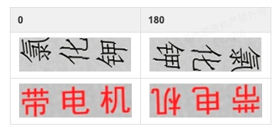

# 文本方向分类器


## 1. 方法介绍
文本方向分类器主要用于图片非0度的场景下，在这种场景下需要对图片里检测到的文本行进行一个转正的操作。在PaddleOCR系统内，
文字检测之后得到的文本行图片经过仿射变换之后送入识别模型，此时只需要对文字进行一个0和180度的角度分类，因此PaddleOCR内置的
文本方向分类器**只支持了0和180度的分类**。如果想支持更多角度，可以自己修改算法进行支持。

0和180度数据样本例子：




## 2. 数据准备

请按如下步骤设置数据集：

训练数据的默认存储路径是 `PaddleOCR/train_data/cls`,如果您的磁盘上已有数据集，只需创建软链接至数据集目录：

```
ln -sf <path/to/dataset> <path/to/paddle_ocr>/train_data/cls/dataset
```

请参考下文组织您的数据。
### 训练集

首先建议将训练图片放入同一个文件夹，并用一个txt文件（cls_gt_train.txt）记录图片路径和标签。

**注意：** 默认请将图片路径和图片标签用 `\t` 分割，如用其他方式分割将造成训练报错

0和180分别表示图片的角度为0度和180度

```
" 图像文件名                 图像标注信息 "
train/cls/train/word_001.jpg   0
train/cls/train/word_002.jpg   180
```

最终训练集应有如下文件结构：
```
|-train_data
    |-cls
        |- cls_gt_train.txt
        |- train
            |- word_001.png
            |- word_002.jpg
            |- word_003.jpg
            | ...
```

- 测试集

同训练集类似，测试集也需要提供一个包含所有图片的文件夹（test）和一个cls_gt_test.txt，测试集的结构如下所示：

```
|-train_data
    |-cls
        |- cls_gt_test.txt
        |- test
            |- word_001.jpg
            |- word_002.jpg
            |- word_003.jpg
            | ...
```

## 3. 启动训练

将准备好的txt文件和图片文件夹路径分别写入配置文件的 `Train/Eval.dataset.label_file_list` 和 `Train/Eval.dataset.data_dir` 字段下，`Train/Eval.dataset.data_dir`字段下的路径和文件里记载的图片名构成了图片的绝对路径。

PaddleOCR提供了训练脚本、评估脚本和预测脚本。

开始训练:

*如果您安装的是cpu版本，请将配置文件中的 `use_gpu` 字段修改为false*

```
# GPU训练 支持单卡，多卡训练，通过 '--gpus' 指定卡号。
# 启动训练，下面的命令已经写入train.sh文件中，只需修改文件里的配置文件路径即可
python3 -m paddle.distributed.launch --gpus '0,1,2,3,4,5,6,7'  tools/train.py -c configs/cls/cls_mv3.yml
```

- 数据增强

PaddleOCR提供了多种数据增强方式，如果您希望在训练时加入扰动，请在配置文件中取消`Train.dataset.transforms`下的`RecAug`和`RandAugment`字段的注释。

默认的扰动方式有：颜色空间转换(cvtColor)、模糊(blur)、抖动(jitter)、噪声(Gasuss noise)、随机切割(random crop)、透视(perspective)、颜色反转(reverse),随机数据增强(RandAugment)。

训练过程中除随机数据增强外每种扰动方式以50%的概率被选择，具体代码实现请参考：
[rec_img_aug.py](../../ppocr/data/imaug/rec_img_aug.py)
[randaugment.py](../../ppocr/data/imaug/randaugment.py)

*由于OpenCV的兼容性问题，扰动操作暂时只支持linux*


## 4. 训练

PaddleOCR支持训练和评估交替进行, 可以在 `configs/cls/cls_mv3.yml` 中修改 `eval_batch_step` 设置评估频率，默认每1000个iter评估一次。训练过程中将会保存如下内容：
```bash
├── best_accuracy.pdopt # 最佳模型的优化器参数
├── best_accuracy.pdparams # 最佳模型的参数
├── best_accuracy.states # 最佳模型的指标和epoch等信息
├── config.yml # 本次实验的配置文件
├── latest.pdopt # 最新模型的优化器参数
├── latest.pdparams # 最新模型的参数
├── latest.states # 最新模型的指标和epoch等信息
└── train.log # 训练日志
```

如果验证集很大，测试将会比较耗时，建议减少评估次数，或训练完再进行评估。

**注意，预测/评估时的配置文件请务必与训练一致。**


## 5. 评估

评估数据集可以通过修改`configs/cls/cls_mv3.yml`文件里的`Eval.dataset.label_file_list` 字段设置。

```
export CUDA_VISIBLE_DEVICES=0
# GPU 评估， Global.checkpoints 为待测权重
python3 tools/eval.py -c configs/cls/cls_mv3.yml -o Global.checkpoints={path/to/weights}/best_accuracy
```


## 6. 预测

* 训练引擎的预测

使用 PaddleOCR 训练好的模型，可以通过以下脚本进行快速预测。

通过 `Global.infer_img` 指定预测图片或文件夹路径，通过 `Global.checkpoints` 指定权重：

```
# 预测分类结果
python3 tools/infer_cls.py -c configs/cls/cls_mv3.yml -o Global.pretrained_model={path/to/weights}/best_accuracy Global.load_static_weights=false Global.infer_img=doc/imgs_words/ch/word_1.jpg
```

预测图片：


得到输入图像的预测结果：

```
infer_img: doc/imgs_words/ch/word_1.jpg
     result: ('0', 0.9998784)
```
