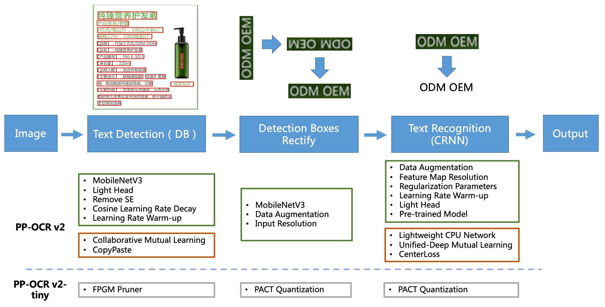

# PP-OCR

## 1. Introduction

PP-OCR is a self-developed practical ultra-lightweight OCR system, which is slimed and optimized based on the reimplemented [academic algorithms](algorithm_en.md), considering the balance between **accuracy** and **speed**.

#### PP-OCR
PP-OCR is a two-stage OCR system, in which the text detection algorithm is [DB](algorithm_det_db_en.md), and the text recognition algorithm is [CRNN](algorithm_rec_crnn_en.md). Besides, a [text direction classifier](angle_class_en.md) is added between the detection and recognition modules to deal with text in different directions.

PP-OCR pipeline is as follows:

PP-OCR system is in continuous optimization. At present, PP-OCR and PP-OCRv2 have been released:

PP-OCR adopts 19 effective strategies from 8 aspects including backbone network selection and adjustment, prediction head design, data augmentation, learning rate transformation strategy, regularization parameter selection, pre-training model use, and automatic model tailoring and quantization to optimize and slim down the models of each module (as shown in the green box above). The final results are an ultra-lightweight Chinese and English OCR model with an overall size of 3.5M and a 2.8M English digital OCR model. For more details, please refer to [PP-OCR technical report](https://arxiv.org/abs/2009.09941).

#### PP-OCRv2
On the basis of PP-OCR, PP-OCRv2 is further optimized in five aspects. The detection model adopts CML(Collaborative Mutual Learning) knowledge distillation strategy and CopyPaste data expansion strategy. The recognition model adopts LCNet lightweight backbone network, U-DML knowledge distillation strategy and enhanced CTC loss function improvement (as shown in the red box above), which further improves the inference speed and prediction effect. For more details, please refer to [PP-OCRv2 technical report](https://arxiv.org/abs/2109.03144).

#### PP-OCRv3

PP-OCRv3 upgraded the detection model and recognition model in 9 aspects based on PP-OCRv2:
- PP-OCRv3 detector upgrades the CML(Collaborative Mutual Learning) text detection strategy proposed in PP-OCRv2, and further optimizes the effect of teacher model and student model respectively. In the optimization of teacher model, a pan module with large receptive field named LK-PAN is proposed and the DML distillation strategy is adopted; In the optimization of student model, a FPN module with residual attention mechanism named RSE-FPN is proposed.
- PP-OCRv3 recognizer is optimized based on text recognition algorithm [SVTR](https://arxiv.org/abs/2205.00159). SVTR no longer adopts RNN by introducing transformers structure, which can mine the context information of text line image more effectively, so as to improve the ability of text recognition. PP-OCRv3 adopts lightweight text recognition network SVTR_LCNet, guided training of CTC by attention, data augmentation strategy TextConAug, better pre-trained model by self-supervised TextRotNet, UDML(Unified Deep Mutual Learning), and UIM (Unlabeled Images Mining) to accelerate the model and improve the effect.

PP-OCRv3 pipeline is as follows:

For more details, please refer to [PP-OCRv3 technical report](https://arxiv.org/abs/2206.03001v2).

## 2. Features

- Ultra lightweight PP-OCRv3 series models: detection (3.6M) + direction classifier (1.4M) + recognition 12M) = 17.0M
- Ultra lightweight PP-OCRv2 series models: detection (3.1M) + direction classifier (1.4M) + recognition 8.5M) = 13.0M
- Ultra lightweight PP-OCR mobile series models: detection (3.0M) + direction classifier (1.4M) + recognition (5.0M) = 9.4M
- General PP-OCR server series models: detection (47.1M) + direction classifier (1.4M) + recognition (94.9M) = 143.4M
- Support Chinese, English, and digit recognition, vertical text recognition, and long text recognition
- Support multi-lingual recognition: about 80 languages like Korean, Japanese, German, French, etc

## 3. benchmark

For the performance comparison between PP-OCR series models, please check the [benchmark](./benchmark_en.md) documentation.

## 4. Visualization [more](./visualization.md)

#### PP-OCRv3 Chinese model

#### PP-OCRv3 English model

#### PP-OCRv3 Multilingual model

## 5. Tutorial

### 5.1 Quick start

- You can also quickly experience the ultra-lightweight OCR : [Online Experience](https://www.paddlepaddle.org.cn/hub/scene/ocr)
- Mobile DEMO experience (based on EasyEdge and Paddle-Lite, supports iOS and Android systems): [Sign in to the website to obtain the QR code for  installing the App](https://ai.baidu.com/easyedge/app/openSource?from=paddlelite)
- One line of code quick use: [Quick Start](./quickstart_en.md)

### 5.2 Model training / compression / deployment

For more tutorials, including model training, model compression, deployment, etc., please refer to [tutorials](../../README.md#Tutorials)。

## 6. Model zoo

## PP-OCR Series Model List（Update on 2022.04.28）

| Model introduction  | Model name | Recommended scene | Detection model  | Direction classifier | Recognition model  |
| ----- | --- | --- | ------ | ---- | ------ |
| Chinese and English ultra-lightweight PP-OCRv3 model（16.2M） | ch_PP-OCRv3_xx          | Mobile & Server   | [inference model](https://paddleocr.bj.bcebos.com/PP-OCRv3/chinese/ch_PP-OCRv3_det_infer.tar) / [trained model](https://paddleocr.bj.bcebos.com/PP-OCRv3/chinese/ch_PP-OCRv3_det_distill_train.tar)         | [inference model](https://paddleocr.bj.bcebos.com/dygraph_v2.0/ch/ch_ppocr_mobile_v2.0_cls_infer.tar) / [trained model](https://paddleocr.bj.bcebos.com/dygraph_v2.0/ch/ch_ppocr_mobile_v2.0_cls_train.tar) | [inference model](https://paddleocr.bj.bcebos.com/PP-OCRv3/chinese/ch_PP-OCRv3_rec_infer.tar) / [trained model](https://paddleocr.bj.bcebos.com/PP-OCRv3/chinese/ch_PP-OCRv3_rec_train.tar)                 |
| English ultra-lightweight PP-OCRv3 model（13.4M）             | en_PP-OCRv3_xx          | Mobile & Server   | [inference model](https://paddleocr.bj.bcebos.com/PP-OCRv3/english/en_PP-OCRv3_det_infer.tar) / [trained model](https://paddleocr.bj.bcebos.com/PP-OCRv3/english/en_PP-OCRv3_det_distill_train.tar)         | [inference model](https://paddleocr.bj.bcebos.com/dygraph_v2.0/ch/ch_ppocr_mobile_v2.0_cls_infer.tar) / [trained model](https://paddleocr.bj.bcebos.com/dygraph_v2.0/ch/ch_ppocr_mobile_v2.0_cls_train.tar) | [inference model](https://paddleocr.bj.bcebos.com/PP-OCRv3/english/en_PP-OCRv3_rec_infer.tar) / [trained model](https://paddleocr.bj.bcebos.com/PP-OCRv3/english/en_PP-OCRv3_rec_train.tar)                 |
| Chinese and English ultra-lightweight PP-OCRv2 model（11.6M） | ch_PP-OCRv2_xx          | Mobile & Server   | [inference model](https://paddleocr.bj.bcebos.com/PP-OCRv2/chinese/ch_PP-OCRv2_det_infer.tar) / [trained model](https://paddleocr.bj.bcebos.com/PP-OCRv2/chinese/ch_PP-OCRv2_det_distill_train.tar)         | [inference model](https://paddleocr.bj.bcebos.com/dygraph_v2.0/ch/ch_ppocr_mobile_v2.0_cls_infer.tar) / [trained model](https://paddleocr.bj.bcebos.com/dygraph_v2.0/ch/ch_ppocr_mobile_v2.0_cls_train.tar) | [inference model](https://paddleocr.bj.bcebos.com/PP-OCRv2/chinese/ch_PP-OCRv2_rec_infer.tar) / [trained model](https://paddleocr.bj.bcebos.com/PP-OCRv2/chinese/ch_PP-OCRv2_rec_train.tar)                 |
| Chinese and English ultra-lightweight PP-OCR model (9.4M)     | ch_ppocr_mobile_v2.0_xx | Mobile & server   | [inference model](https://paddleocr.bj.bcebos.com/dygraph_v2.0/ch/ch_ppocr_mobile_v2.0_det_infer.tar) / [trained model](https://paddleocr.bj.bcebos.com/dygraph_v2.0/ch/ch_ppocr_mobile_v2.0_det_train.tar) | [inference model](https://paddleocr.bj.bcebos.com/dygraph_v2.0/ch/ch_ppocr_mobile_v2.0_cls_infer.tar) / [trained model](https://paddleocr.bj.bcebos.com/dygraph_v2.0/ch/ch_ppocr_mobile_v2.0_cls_train.tar) | [inference model](https://paddleocr.bj.bcebos.com/dygraph_v2.0/ch/ch_ppocr_mobile_v2.0_rec_infer.tar) / [trained model](https://paddleocr.bj.bcebos.com/dygraph_v2.0/ch/ch_ppocr_mobile_v2.0_rec_train.tar) |
| Chinese and English general PP-OCR model (143.4M)             | ch_ppocr_server_v2.0_xx | Server            | [inference model](https://paddleocr.bj.bcebos.com/dygraph_v2.0/ch/ch_ppocr_server_v2.0_det_infer.tar) / [trained model](https://paddleocr.bj.bcebos.com/dygraph_v2.0/ch/ch_ppocr_server_v2.0_det_train.tar) | [inference model](https://paddleocr.bj.bcebos.com/dygraph_v2.0/ch/ch_ppocr_mobile_v2.0_cls_infer.tar) / [trained model](https://paddleocr.bj.bcebos.com/dygraph_v2.0/ch/ch_ppocr_mobile_v2.0_cls_train.tar) | [inference model](https://paddleocr.bj.bcebos.com/dygraph_v2.0/ch/ch_ppocr_server_v2.0_rec_infer.tar) / [trained model](https://paddleocr.bj.bcebos.com/dygraph_v2.0/ch/ch_ppocr_server_v2.0_rec_train.tar) |

For more model downloads (including multiple languages), please refer to [PP-OCR series model downloads](./models_list_en.md).

For a new language request, please refer to [Guideline for new language_requests](../../README.md#language_requests).
